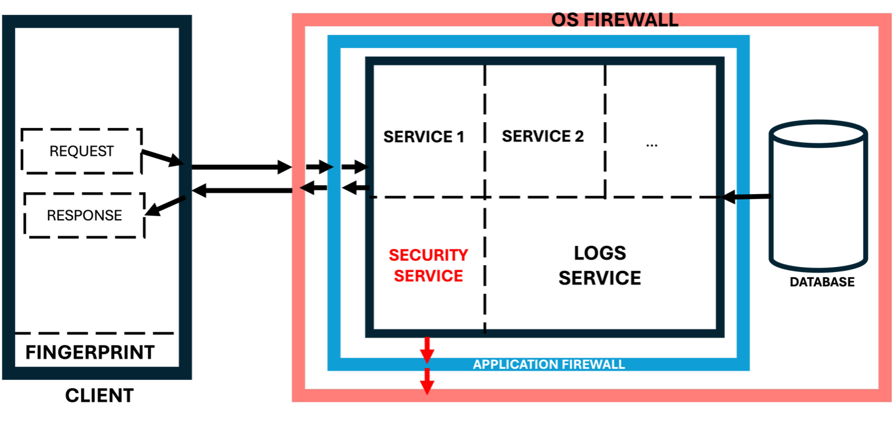
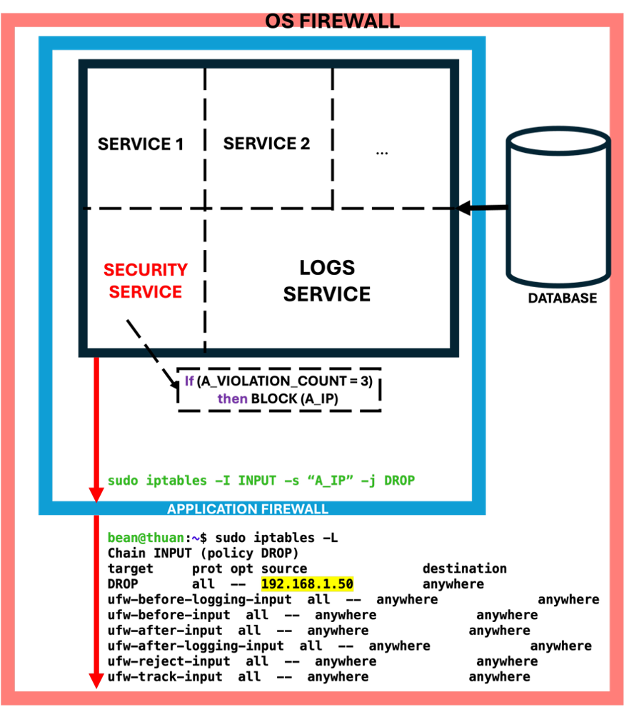
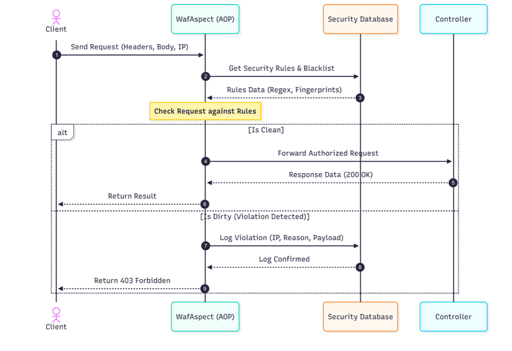
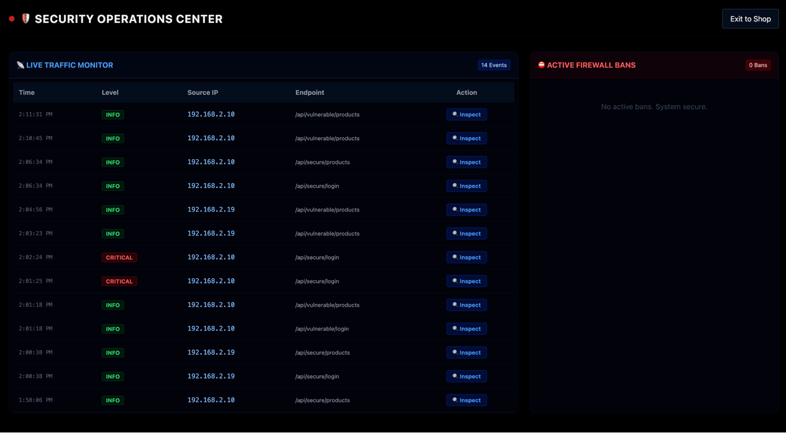
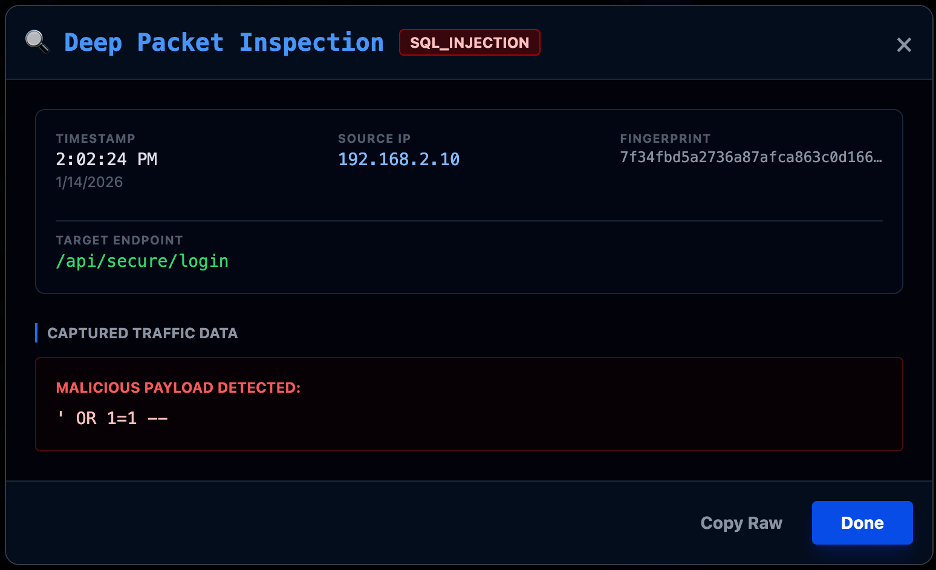

# Adaptive Multiple Layer Defense SQL Injection Application

## About The Project

In the rapidly evolving field of modern web development, traditional single-layer defense solutions often fail against attackers who use VPNs or IP rotation to bypass security. This creates a "Whac-A-Mole" scenario where blocking a single IP address does not prevent a persistent threat.

This **Adaptive Multiple Layer Defense System** was built to bridge the gap between application-layer detection and network-layer enforcement. By utilizing **Browser Fingerprinting**, the system identifies attackers based on their unique hardware and software configurations rather than transient IP addresses. When a threat is confirmed at the application level, the software programmatically updates the Linux kernel's `iptables` rules to drop all packets from the identified source in real-time.

### Key Features
* **Persistent Identification:** Uses Browser Fingerprinting to extract device entropy (screen resolution, fonts, canvas properties) to create a consistent ID that persists across different network identities.
* **AOP-Driven Traffic Inspection:** Implements Aspect-Oriented Programming (AOP) via a `WafAspect` to intercept and validate requests without polluting core business logic.
* **The "Cross-Layer Bridge":** Automatically triggers Layer 4 network blocks using `iptables` when a specific fingerprint reaches a "3 strikes" violation threshold.
* **Evasion Detection:** Proactively identifies and blocks new IP addresses used by previously blacklisted fingerprints, rendering VPN-switching ineffective.
* **Security Operations Center (SOC) Dashboard:** A real-time monitoring interface to categorize traffic and manage active firewall bans.

---

## System Architecture & Design Approach

The system adopts a **Defense in Depth** strategy, in line with NIST SP 800-61 guidelines, providing the capability to defend against attacks in both the application layer and the infrastructure layer.

*Figure 1: Proposed System Architecture for Adaptive SQL Injection Defense.*

### Core Components
1.  **Application Layer (Java/Spring Boot):** Handles Deep Packet Inspection (DPI) and maintains a stateful "Violation Count" for each unique device fingerprint.
2.  **Infrastructure Layer (Linux/Iptables):** Acts as the final enforcement point by dropping malicious packets at the kernel level.
3.  **Cross-Layer Identity Bridge:** The logic that maps Layer 7 identification to Layer 4 network enforcement.
4.  **[Frontend](https://github.com/tienthuan19/advanced-sqli-mitigation-frontend.git)**: ReactJS and FingerprintJS.

---

## Implementation Details

### Browser Fingerprinting
Instead of relying on cookies or IP addresses, the system generates a unique Device ID based on various hardware and software quirks.

*Figure 2: Mechanism of Generating Unique Device ID from Client Entropy.*

### Cross-Layer Enforcement
When the violation threshold is met, the system triggers a privileged shell command to block the offending IP.

*Figure 3: Triggering Network Layer Enforcement from Application Logic.*

---

## Core Workflows (Sequence Diagrams)

The following diagram illustrates the request interception and validation logic implemented via Aspect-Oriented Programming (AOP), ensuring that malicious data is cleaned at the gateway layer.

*Figure 5: Sequence Diagram illustrating Request Interception and Validation via AOP.*

---

## Evaluation and Results

### Real-time Threat Monitoring
The built-in SOC Dashboard categorizes traffic in real-time. Legitimate requests are logged as `INFO`, while SQL injection attempts are flagged as `CRITICAL`.

*Figure 6: The Security Operations Center (SOC) Dashboard displaying real-time traffic logs.*

### Forensic Analysis
The system allows for detailed event inspection, revealing the raw malicious payload (e.g., `' OR 1=1 --`) and the associated attacker fingerprint.

*Figure 7: Detailed Event Log revealing the raw malicious payload.*

### Evasion Resistance
If an attacker attempts to bypass a block by rotating their IP address while maintaining the same device settings, the system detects the blacklisted fingerprint and pre-emptively blocks the new IP.

*Figure 8: Cross-Layer Defense Effectiveness (The "Access Denied" Scenario).*

---

## Tech Stack
* **Core Backend:** Java, Spring Boot.
* **Frontend:** React (for UI and Fingerprinting).
* **Security:** Spring AOP.
* **Database:** PostgreSQL.
* **Firewall Controller:** Linux `iptables` / `ufw`.
* **Build Tool:** Maven.

---

## Key Design Decisions & Trade-offs

1.  **Stateful Tracking by Fingerprint:** Unlike stateless firewalls, this system tracks cumulative activity. This allows it to distinguish between accidental errors and persistent, targeted attacks.
2.  **Privileged Execution:** The application requires `sudo` privileges to modify `iptables`. While this increases the privilege level of the app, it provides a level of protection that application-level filters alone cannot match.
3.  **Automatic Mitigation:** The system includes a scheduled task to automatically unblock expired IP bans (24-hour duration), ensuring the firewall rules remain clean and dynamic.
4.  **Decoupled Security Logic:** By using AOP, the security layer is entirely separated from the business controllers (`VulnerableController` vs `SecureController`), making the defense easy to maintain and scale.
